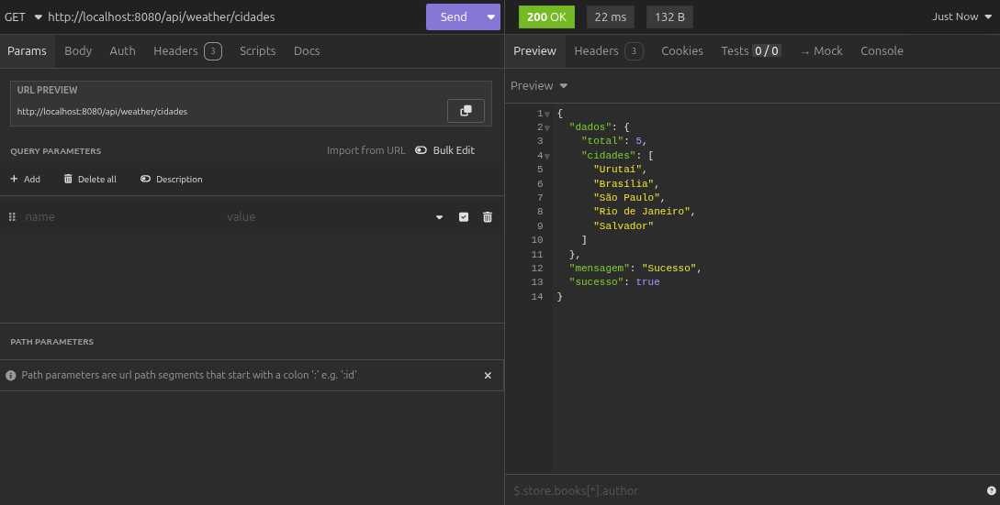
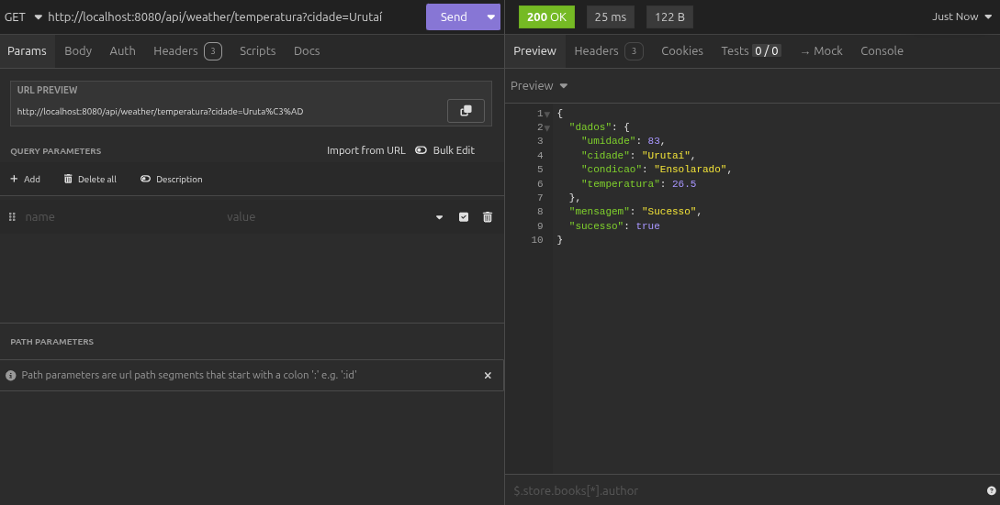
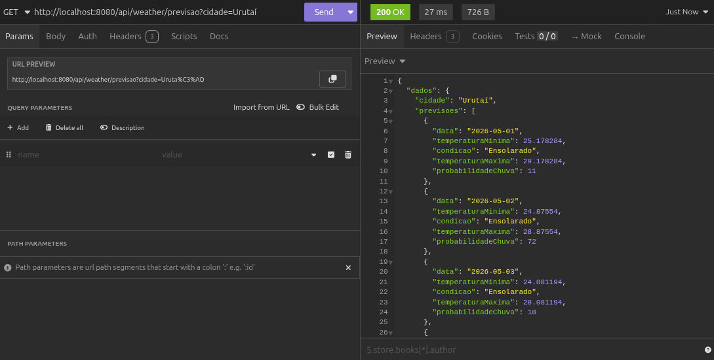
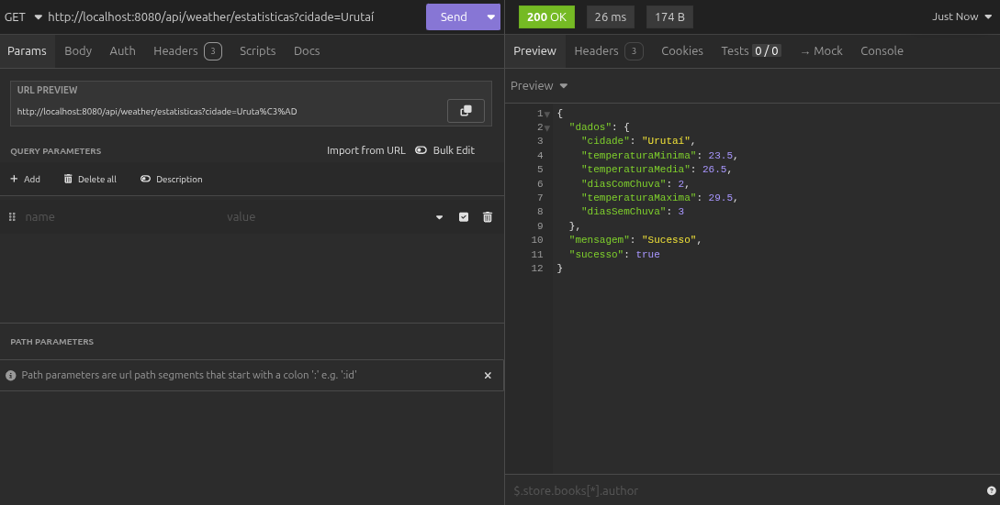
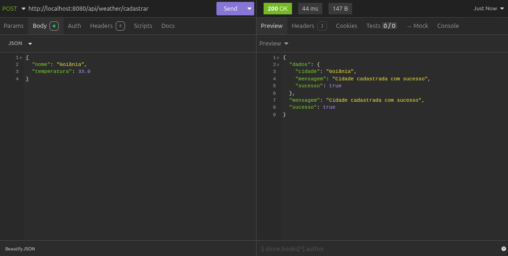

# Sistema de Previsão Meteorológica Distribuído com gRPC e Spring Boot

Sistema distribuído cliente-servidor para fornecimento de informações meteorológicas. O servidor expõe 5 serviços via gRPC e o cliente atua como uma API REST que consome esses serviços.

---

## Estrutura do Projeto

```
gRPC/
├── weather-server/   # Servidor gRPC (porta 9090)
└── weather-client/   # Cliente REST + gRPC (porta 8080)
```

---

## Pré-requisitos

- Java 17 ou superior
- Maven 3.8+

---

## Como Rodar o Projeto

### 1. Iniciar o Servidor gRPC

```bash
cd weather-server
mvn spring-boot:run
```

O servidor estará disponível na porta `9090`.

### 2. Iniciar o Cliente REST

Abra um **novo terminal**:

```bash
cd weather-client
mvn spring-boot:run
```

O cliente estará disponível em `http://localhost:8080`.

> Certifique-se de iniciar o servidor **antes** do cliente.

---

## Endpoints Disponíveis

Base URL: `http://localhost:8080/api/weather`

| Método | Rota | Parâmetro | Descrição |
|--------|------|-----------|-----------|
| GET | `/temperatura` | `?cidade=NomeDaCidade` | Temperatura atual da cidade |
| GET | `/previsao` | `?cidade=NomeDaCidade` | Previsão para os próximos 5 dias |
| GET | `/cidades` | — | Lista todas as cidades cadastradas |
| GET | `/estatisticas` | `?cidade=NomeDaCidade` | Estatísticas climáticas da cidade |
| POST | `/cadastrar` | Body JSON | Cadastra uma nova cidade |

### Exemplos de Requisição

**Listar cidades:**
```
GET http://localhost:8080/api/weather/cidades
```

**Temperatura atual:**
```
GET http://localhost:8080/api/weather/temperatura?cidade=Urutaí
```

**Previsão 5 dias:**
```
GET http://localhost:8080/api/weather/previsao?cidade=Urutaí
```

**Estatísticas climáticas:**
```
GET http://localhost:8080/api/weather/estatisticas?cidade=Urutaí
```

**Cadastrar nova cidade:**
```
POST http://localhost:8080/api/weather/cadastrar
Content-Type: application/json

{
  "nome": "Goiânia",
  "temperatura": 33.0
}
```

### Cidades pré-cadastradas

- Urutaí
- Brasília
- Rio de Janeiro
- São Paulo
- Salvador

---

## O Arquivo .proto

O arquivo `weather.proto` é o contrato central do sistema. Ele define os serviços, mensagens e RPCs compartilhados entre servidor e cliente.

**Localização:** `weather-server/src/main/proto/weather.proto` e `weather-client/src/main/proto/weather.proto`

### Definição do Serviço

```protobuf
service WeatherService {
  rpc GetTemperaturaAtual(CidadeRequest) returns (TemperaturaResponse);
  rpc GetPrevisaoCincoDias(CidadeRequest) returns (PrevisaoResponse);
  rpc ListarCidades(Empty) returns (CidadesListResponse);
  rpc CadastrarCidade(CadastrarCidadeRequest) returns (CidadeResponse);
  rpc GetEstatisticasClimaticas(CidadeRequest) returns (EstatisticasResponse);
}
```

O bloco `service` declara quais operações remotas o servidor oferece. Cada linha `rpc` define:
- **nome do método** que pode ser chamado remotamente
- **mensagem de entrada** (o que o cliente envia)
- **mensagem de retorno** (o que o servidor responde)

### Definição das Mensagens

```protobuf
message CidadeRequest {
  string nome = 1;
}
```
Mensagem de entrada para requisições que exigem o nome de uma cidade.

```protobuf
message TemperaturaResponse {
  string cidade = 1;
  float temperatura = 2;
  string condicao = 3;
  int32 umidade = 4;
}
```
Retorna a temperatura atual, condição climática e umidade de uma cidade.

```protobuf
message PrevisaoResponse {
  string cidade = 1;
  repeated PrevisaoDia previsoes = 2;
}

message PrevisaoDia {
  string data = 1;
  float temperaturaMaxima = 2;
  float temperaturaMinima = 3;
  string condicao = 4;
  int32 probabilidadeChuva = 5;
}
```
`repeated` indica uma lista de itens. `PrevisaoDia` é uma sub-mensagem que representa um dia da previsão.

```protobuf
message CadastrarCidadeRequest {
  string nome = 1;
  float temperatura = 2;
}

message CidadeResponse {
  bool sucesso = 1;
  string mensagem = 2;
  string cidade = 3;
}
```
Usado para cadastrar uma nova cidade. A resposta indica se a operação foi bem-sucedida.

```protobuf
message CidadesListResponse {
  repeated string cidades = 1;
  int32 total = 2;
}
```
Retorna a lista de cidades disponíveis e a quantidade total.

```protobuf
message EstatisticasResponse {
  string cidade = 1;
  float temperaturaMedia = 2;
  float temperaturaMinima = 3;
  float temperaturaMaxima = 4;
  int32 diasComChuva = 5;
  int32 diasSemChuva = 6;
}
```
Retorna estatísticas climáticas calculadas para a cidade informada.

```protobuf
message Empty {}
```
Mensagem vazia utilizada quando a requisição não precisa de parâmetros (ex: listar cidades).

### Explicação de Cada RPC

| RPC | Entrada | Saída | Descrição |
|-----|---------|-------|-----------|
| `GetTemperaturaAtual` | `CidadeRequest` | `TemperaturaResponse` | Retorna temperatura, condição e umidade atuais |
| `GetPrevisaoCincoDias` | `CidadeRequest` | `PrevisaoResponse` | Retorna lista com previsão para os próximos 5 dias |
| `ListarCidades` | `Empty` | `CidadesListResponse` | Retorna todas as cidades cadastradas no sistema |
| `CadastrarCidade` | `CadastrarCidadeRequest` | `CidadeResponse` | Cadastra nova cidade com temperatura simulada |
| `GetEstatisticasClimaticas` | `CidadeRequest` | `EstatisticasResponse` | Retorna média, mínima, máxima e dias de chuva |

### Como o .proto Gera Código (Stubs)

Durante o build com Maven (`mvn compile`), o plugin `protobuf-maven-plugin` executa o compilador `protoc`, que lê o arquivo `.proto` e gera automaticamente:

- **Classes de mensagem** (ex: `CidadeRequest`, `TemperaturaResponse`) — com métodos `newBuilder()`, getters e setters
- **`WeatherServiceGrpc.java`** — contendo:
  - `WeatherServiceImplBase`: classe abstrata que o servidor estende para implementar os RPCs
  - `WeatherServiceBlockingStub`: usado pelo cliente para fazer chamadas síncronas ao servidor

O código gerado fica em:
```
target/generated-sources/protobuf/java/      # classes de mensagem
target/generated-sources/protobuf/grpc-java/ # stubs gRPC
```

---

## Fluxo Completo: de HTTP para gRPC

Abaixo está o caminho percorrido por uma requisição desde o Postman até o servidor gRPC e de volta:

```
Postman
  │
  │  GET /api/weather/temperatura?cidade=Urutaí  (HTTP)
  ▼
WeatherController.java
  │  Recebe o parâmetro "cidade" via @RequestParam
  │  Chama grpcService.getTemperatura("Urutaí")
  ▼
WeatherGrpcService.java
  │  Monta o objeto CidadeRequest com o nome da cidade
  │  Chama weatherServiceStub.getTemperaturaAtual(request)
  │  O stub serializa a requisição em Protocol Buffers (binário)
  ▼
  │  Comunicação via TCP na porta 9090 usando HTTP/2
  ▼
WeatherServiceImpl.java  (Servidor)
  │  Recebe o CidadeRequest desserializado
  │  Busca os dados da cidade no HashMap em memória
  │  Constrói o TemperaturaResponse com os dados
  │  Chama responseObserver.onNext(response)
  │  Chama responseObserver.onCompleted()
  ▼
  │  Resposta serializada em Protocol Buffers volta pelo canal gRPC
  ▼
WeatherGrpcService.java  (Cliente)
  │  Recebe o TemperaturaResponse desserializado
  ▼
WeatherController.java
  │  Converte o objeto para Map<String, Object>
  │  Serializa como JSON
  ▼
Postman
     Exibe o JSON com os dados meteorológicos
```

**Resumo:** O cliente nunca conhece os detalhes internos do servidor. Toda a comunicação é feita através do contrato definido no `.proto`, usando Protocol Buffers como formato de serialização eficiente sobre HTTP/2.

---

## Prints do Sistema Funcionando

### 1. Listar Cidades


### 2. Temperatura Atual


### 3. Previsão 5 Dias


### 4. Estatísticas Climáticas


### 5. Cadastrar Nova Cidade

---

## Tecnologias Utilizadas

| Tecnologia | Versão | Uso |
|------------|--------|-----|
| Java | 21 | Linguagem principal |
| Spring Boot | 3.1.5 | Framework base |
| gRPC | 1.59.0 | Comunicação cliente-servidor |
| Protocol Buffers | 3.24.4 | Serialização de mensagens |
| Maven | 3.8+ | Build e gerenciamento de dependências |
